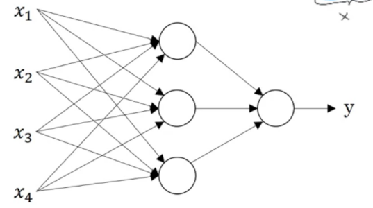
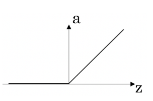
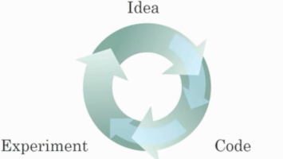

# Notes

### What is a neural network?

A simple neural network is when there is an input of `X`, amount of data,feed to a neuron then output of a prediction of `Y`. A large neural network is when there is more than one neuron stack together, and a deep neural network is when there is multiple layers of those stack neuron connected through activation function to produce or predict `Y`.

### **RelU (Rectified Linear Unit)** - activation function for returning all negative activation to zero.

### **Supervised Learning** - When the input data, `X`, and output prediction,`Y`, was given to the feed into the machine learning algorithm or neural network to train it to produce some prediction from `X` in relationship to `Y`.

### **Structured data** - is data that has features that has a very well defined meaning, such as tables.

### **Unstructured data** - refers to things such as audio, images, videos, and/or text, where you might want to recognize the meaning.

### Reason for Deep Learning recently taking off are:

- We have access to a lot more data. The digitalization of our society has played a huge role in this.
- Deep learning has resulted in significant improvements in important applications such as online advertising, speech recognition, and image recognition.
- We have access to a lot more computational power. The development of hardward, perhaps especially GPU computing, has significantly improved deep learning algorithms' performance.

### Iteration over different ML ideas.

- Faster computation can help speed up how long a team takes to iterate to a good idea
- Being able to try out ideas quickly allows deep learning engineers to iterate more quickly
- Recent progress in deep learning algorithms has allowed us to train good models faster (even without changing the CPU/GPU hardware).

### **Big network usually performs better than small networks.** Increasing the size of a neural network generally does not hurt an algorithm's performance, and it may help significantly.

### **Bringing more data to a model is almost always beneficial.** Increasing the training set size generally does not hurt an algorithm's performance, and it may help significantly.
