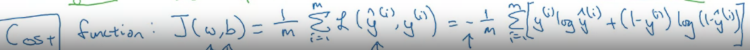

### Learning Objectives

- Build a logistic regression model structured as a shallow neural network
- Build the general architecture of a learning algorithm, including parameter initialization, cost function and gradient calculation, and optimization implemetation (gradient descent)
- Implement computationally efficient and highly vectorized versions of models
- Compute derivatives for logistic regression, using a backpropagation mindset
- Use Numpy functions and Numpy matrix/vector operations
- Work with iPython Notebooks
- Implement vectorization across multiple training examples

---

# Notes

### Binary classification - with the inputs of data the output is going to be either 0 or 1

### Image is stored in a computer as three channels, one for Red, one for Green and one for Blue, RGB. With a full-colored image there would be N^2(64 x 64) numbers of pixels with the 3 channels (N^2 x 3 or N x N x 3).

### Logistic regression is an algorithm for binary classification.

- Given x, ouput of $\hat{y}$, which is the binary of 0 or 1.
- Parameters of W, an n x dimensional vector, and b, a real number
- Output: $\hat{y}$ = Sigmoid $(\frac{w^Tx + b}{z})$

### Sigmoid - Activation function, where given x to output of value between 0 and 1.

- Sigmoid: $\frac{1}{1 + e^{-z}}$
- If z is large, sigmoid = 1 or close to 1
- If z is small or large negative, sigmoid = 0 or close to 0

#### Squared error: $L = (\hat{y}, y) = \frac{1}{2} (\hat{y}-y)^2$

#### Loss (error) function: $L(\hat{y}, y) = -(y\log{(\hat{y})} + (1-y)\log{(1-\hat{y})})$

- Which apply to one training data

### Cost Function: $J(w, b) = \frac{1}{m} \sum_{i=1}^{m} L(\hat{y}^{(i)}, y^{(i)})$

- Which apply to the whole training data
- With Loss Function: $J(w, b) = -\frac{1}{m} \sum_{i=1}^{m} [y^{(i)}\log{(\hat{y}^{(i)})} + (1-y^{(i)})\log{(1-\hat{y}^{(i)})}]$

