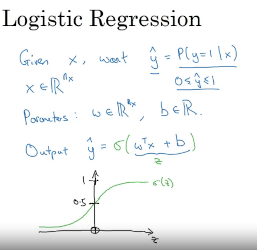
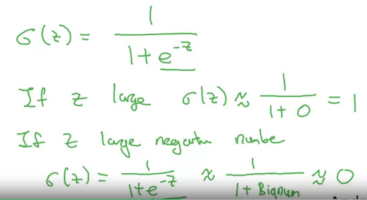
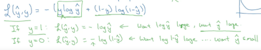
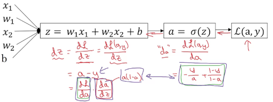
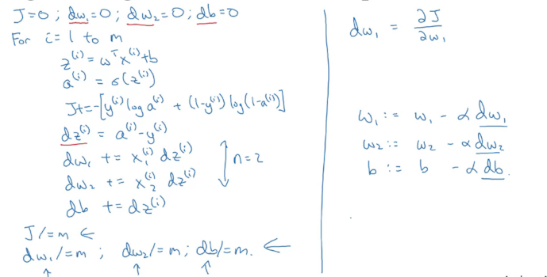

### Learning Objectives

- Build a logistic regression model structured as a shallow neural network
- Build the general architecture of a learning algorithm, including parameter initialization, cost function and gradient calculation, and optimization implemetation (gradient descent)
- Implement computationally efficient and highly vectorized versions of models
- Compute derivatives for logistic regression, using a backpropagation mindset
- Use Numpy functions and Numpy matrix/vector operations
- Work with iPython Notebooks
- Implement vectorization across multiple training examples

---

# Notes

### Binary classification - with the inputs of data the output is going to be either 0 or 1

### Image is stored in a computer as three channels, one for Red, one for Green and one for Blue, RGB. With a full-colored image there would be N^2(64 x 64) numbers of pixels with the 3 channels (N^2 x 3 or N x N x 3).

### Logistic regression is an algorithm for binary classification.

- Given x, ouput of $\hat{y}$, which is the binary of 0 or 1.
- Parameters of W, an n x dimensional vector, and b, a real number
- Output: $\hat{y}$ = Sigmoid $(\frac{w^Tx + b}{z})$

### Sigmoid - Activation function, where given x to output of value between 0 and 1.

- Sigmoid: $\frac{1}{1 + e^{-z}}$
- If z is large, sigmoid = 1 or close to 1
- If z is small or large negative, sigmoid = 0 or close to 0

#### Squared error: $L = (\hat{y}, y) = \frac{1}{2} (\hat{y}-y)^2$

#### Loss (error) function: $L(\hat{y}, y) = -(y\log{(\hat{y})} + (1-y)\log{(1-\hat{y})})$

- Which apply to one training data

### Cost Function: $J(w,b) = \frac{1}{m} \sum^{m}_{i=1} L(\hat{y}^{(i)}, y^{(i)})$

- Which apply to the whole training data
- $\sum$ : sum of
- With Loss Function: $J(w,b) = -\frac{1}{m} \sum^{m}_{i=1} (y^{(i)}\log{(\hat{y}^{(i)})} + (1-y^{(i)})\log{(1-\hat{y}^{(i)})})$

### Gradient Descent

- Want to find w, b that minimize $J(w,b)$
- Initialize w, b with zero for logistic regression
- Repeatly update $w := w - \alpha \frac{d J(w)}{d w}$
- := : as update
- $d$ : the derivative
- $\alpha$: is learning rate
- iterates update w until the algorithm converges

### Function for update to implement:

- $ w := w - \alpha \frac{d J(w, b)}{dw}$
- $ b := b - \alpha \frac{d J(w, b)}{db}$
- where J(w, b) is the Cost Function

### Derivative

- With a straight line the derivative doesn't change.
- $ f(a)=a^2$, $\frac{d}{da}f(a) = 2a$
- $ f(a)=a^3$, $\frac{d}{da}f(a) = 3a^2$
- $ f(a)=\log{(a)}$, $\frac{d}{da}f(a) = \frac{1}{a}$
- The derivative of the function just means the slope of a function and the slope of a function can be different at different points on the function.
- The slope or the derivative can be different at different points on the curve.

### Computation graph

- A forward pass or a forward propagation step, in which we compute the output of the neural network
- Followed by a backward pass or back propagation step, which we use to compute gradients or compute derivatives.

- EX: The steps to compute $J(a,b,c) = 3(a+bc)$:

1. compute $bc$ : `u = b*c`
2. compute $a+u$ : `v = a + u`
3. compute $3v$ : `J = 3v`

- Computation graph organizes a computation with left-to-right computation.

### Derivatives with a Computation Graph

- Computation with right-to-left
- This is called the chain rule, which if $a$ affects $v$, affects $J$, then the amounts that $J$ changes when you nudge $a$ is the product of how much $v$ changes when you nudge $a$ times how much $J$ changes when you nudge $v$.
- $\frac{x}{y} = \frac{x}{z} * \frac{z}{y}$
- $\frac{dJ}{da} = \frac{dJ}{dv} * \frac{dv}{da}$
- Ex: when $\frac{dJ}{da}=3$ and $\frac{dv}{da}=1$ then $\frac{dJ}{da}=3*1=3$

### $dvar$ represent the derivative of a final output variable with respect to various intermediate quantities.

### Logistic Regression Gradient Descent

- Logistic regression recap

  $z = w^{T}x + b$

  $\hat{y} = a = \sigma(z)$

  $L(a,y) = -(y\log{(a)} = (1 - y) \log{(1-a)}$

- Compute given $x^1$, $x^2$:

  $z = w_1x_1 + w_2x_2 + b$ -> $\hat{y} = a = \sigma(z)$ -> $L(a,y)$

  

- Compute backward:

  "$da$" = $\frac{dL(a,y)}{da}$ = $- \frac{y}{a} + \frac{1-y}{1-a}$

  "$dz$" = $\frac{dL}{dz}$ = $\frac{dL(a,y)}{dz}$ = $a-y$

  

  Finally, calculate the derivatives:

  $dw_1 = x_1dz$

  $dw_2=x_2dz$

  $db=dz$

  Then with gradient decent update to:

  $w_1 := w_1 - \alpha dw_1$

  $w_2 := w_2 - \alpha dw_2$

  $b := b - \alpha db$

### Gradient Descent on m Example:

- One step Gradient Descent:
  

---
